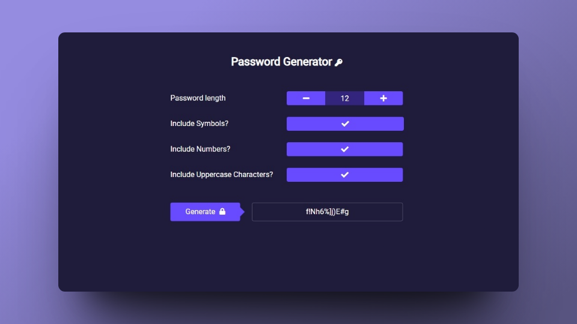

# Customizable Password Generator

This is a customizable password generator developed with vanilla JavaScript. With this application, you can create secure and personalized passwords to protect your online accounts.

## Features

- Generates random and secure passwords.
- Customize the length of generated passwords.
- Includes uppercase letters, lowercase letters, numbers, and special characters in passwords.

You can access this customizable password generator online by visiting the following link: [Customizable Password Generator](https://customizedpasswordgenerator.netlify.app/).
